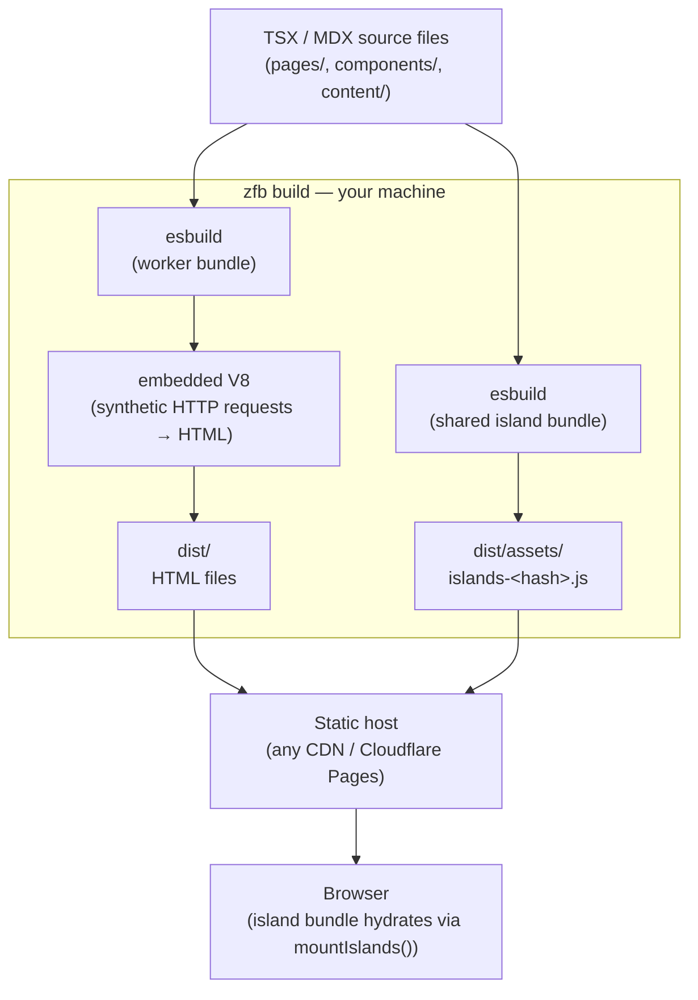

<Info title="このページで扱う内容">

2 バンドルモデル、ビルド時パイプライン全体の図、なぜワーカーバンドルが
Cloudflare Workers モジュールの形をしているのか、そして esbuild と JS ランタイムを
差し替え可能に保つレイヤリングの原則。ステップごとのビルドパイプラインについては
[Build pipeline](/concepts/build-pipeline) を参照してください。

</Info>

zfb は 2 種類の JavaScript 出力を生成し、それらを 2 つの異なる宛先に送り、そこへ
到達するために 2 つの異なる実行環境を使います。まずこの分割を頭の中で整理しておくと、
残りのアーキテクチャがすっと腑に落ちます。

## 2 つのバンドル、2 つの宛先

**ワーカーバンドル — ビルド時専用、ユーザーには決して配信されません。**

`zfb build` を実行すると、最初に起こるのは esbuild があなたの TSX ページ・レイアウト・
コンポーネントを単一のワーカーバンドルにコンパイルすることです。このバンドルは
Cloudflare Workers モジュールの形をしています。`fetch` ハンドラだけをエクスポートし、
それ以外には何もエクスポートしません。

```ts
export default {
  fetch(request: Request, env: Env, ctx: ExecutionContext): Response { ... }
};
```

Rust オーケストレーターはこのバンドルを組み込み V8 アイソレートにロードし、合成 HTTP
リクエスト（ページ URL ごとに 1 リクエスト）で駆動します。各合成リクエストは HTML の
`Response` を生成します。オーケストレーターはそれらのレスポンスを `dist/` にプレーンな
`.html` ファイルとして書き出します。ビルドが終わるとアイソレートは破棄されます。ビルド時、
ワーカーバンドルがあなたのマシンを離れることは決してありません。これは Rust
オーケストレーターが静的出力を生成するために駆動する *ツール* です。（同じバンドルの形は、
`prerender = false` のルート向けに変更なしで Cloudflare Workers にもデプロイされます。
その本番経路についてはこのページの後半と
[SSR guide](/guides/ssr-and-cloudflare-bindings) で扱います。）

**アイランドバンドル — ブラウザに配信されます。**

`"use client"` でマークされたコンポーネントは別物です。esbuild はそれらすべてをまとめて
単一の共有 ESM モジュール（`dist/assets/islands-<hash>.js`）にバンドルし、それは HTML
ファイルと並んで `dist/assets/` に配置されます。アイランドを含むビルドでは、このバンドルを
参照する単一の `<script type="module">` タグがプロジェクト全体に注入されます。バンドルは
読み込み時に `mountIslands()` を呼び出し、ページ上のすべての `[data-zfb-island]` 要素を
ハイドレートします。アイランドバンドルはエンドユーザーに到達する *唯一* の JavaScript です。

この区別が重要なのは、2 つのバンドルがまったく異なるライフタイム、異なる実行環境、異なる
最適化目標を持つからです。両者を混同することが、zfb の動作についての混乱のほとんどの原因です。

`"use client"` でオプトインする方法については [Islands](/concepts/islands) を参照してください。

## 何がどこで動くのか



`zfb build` のボックス内のすべては、ビルド時にあなたのマシン上で動き、ビルドが終わると
終了します。静的デプロイでは、このボックス内のどれもリクエスト時にサーバーで動くことは
ありません。

ビルドオーケストレーターがこれらのステップをどう調整するのかという、より踏み込んだ話は
[Build engine](/architecture/build-engine) を参照してください。

## Hono / Cloudflare Workers への移植性という賭け

ワーカーバンドルの形 — `export default { fetch }` — は偶然ではありません。これは
Cloudflare Workers デプロイが期待するのと同じコントラクトです。つまり、Rust
オーケストレーターがビルド時に駆動するバンドルは、変更なしで Cloudflare Workers に
デプロイでき、静的プリレンダリングをオプトアウトしたルートに対しては workerd が本番で
それを実行します。

ルーティングのコア（`@takazudo/zfb-runtime` の `createPageRouter`）は Hono のアダプタ
パターンに従います。ルーターは 1 つ、エントリアダプタは複数。ビルド時アダプタは合成の
`Request` オブジェクトを与え、`Response` 文字列を収集します。Cloudflare Workers
アダプタはそれをワーカーの `fetch` ハンドラとして登録します。ルーター自身は、どのアダプタが
自分を駆動しているのかを知りません。

これが移植性の賭けです。バンドルの形を安定したコントラクトとして固定することで、zfb は
それを実行する JS エンジンから切り離されたままでいられます。ビルド時ホストは組み込み V8
アイソレート、本番ホストは workerd。コントラクト — `export default { fetch }` — は
どちらの文脈でも同じです。

`packages/zfb-adapter-cloudflare` は Cloudflare Workers 向けのデプロイアダプタです。
`zfb build --target=cloudflare` が生成したバンドルを受け取り、`wrangler deploy` が
期待する薄いシェルで包みます。2 ファイル構成のワーカー出力と、ランタイムでリクエストが
どうディスパッチされるのかを深掘りするには
[SSR on a Worker (adapter mode)](/concepts/ssr-on-a-worker) を参照してください。

この設計の完全な根拠は [JS Runtime](/architecture/js-runtime) にあります。組み込み V8
ホストの設計と、なぜバンドルコントラクトがエンジン非依存なのか。SSG ファーストで
Hono/Workers のバンドル形を選んだのは、ビルド時と本番の実行環境を互換に保つためであり、
当初のインプロセス `deno_core` アプローチは、パフォーマンスと分離の要件が明確になった
時点で組み込み V8 アイソレートに置き換えられました。

## レイヤリングのまとめ

3 つのレイヤー、それぞれに明確な役割があります。

| レイヤー | 何を所有するか | 何を所有しないか |
|-------|-------------|----------------------|
| **あなたのソース** | ページ、コンポーネント、コンテンツ、スタイル | ビルドの仕組み |
| **zfb** | ビルドコントラクト — ルートテーブル、ページ props の形、アイランドプロトコル、`dist/` のレイアウト | どのバンドラ、どの JS ランタイムか |
| **ツール** | esbuild（バンドル）、組み込み V8（ビルド時評価） | あなたのコードのセマンティクス |

zfb はコントラクトを所有します。どんな入力を受け付けるのか、出力がどう見えるのか、ビルドを
通してどんな不変条件が成り立つのか。esbuild と組み込み V8 ランタイムは実装の詳細であり、
ユーザーコードに触れることなく `RenderHost` トレイトの背後で差し替えられます。

バンドラは安くて速いノコギリです。zfb は大工です。

コントラクトの下流:

- [Islands](/concepts/islands) — `"use client"` がどのようにコンポーネントをアイランドバンドルにオプトインさせるのか
- [Build engine](/architecture/build-engine) — Rust クレートがどのようにパイプラインを調整するのか
- [Incremental rebuild](/concepts/incremental-rebuild) — 依存グラフがどのように dev リビルドを高速に保つのか
