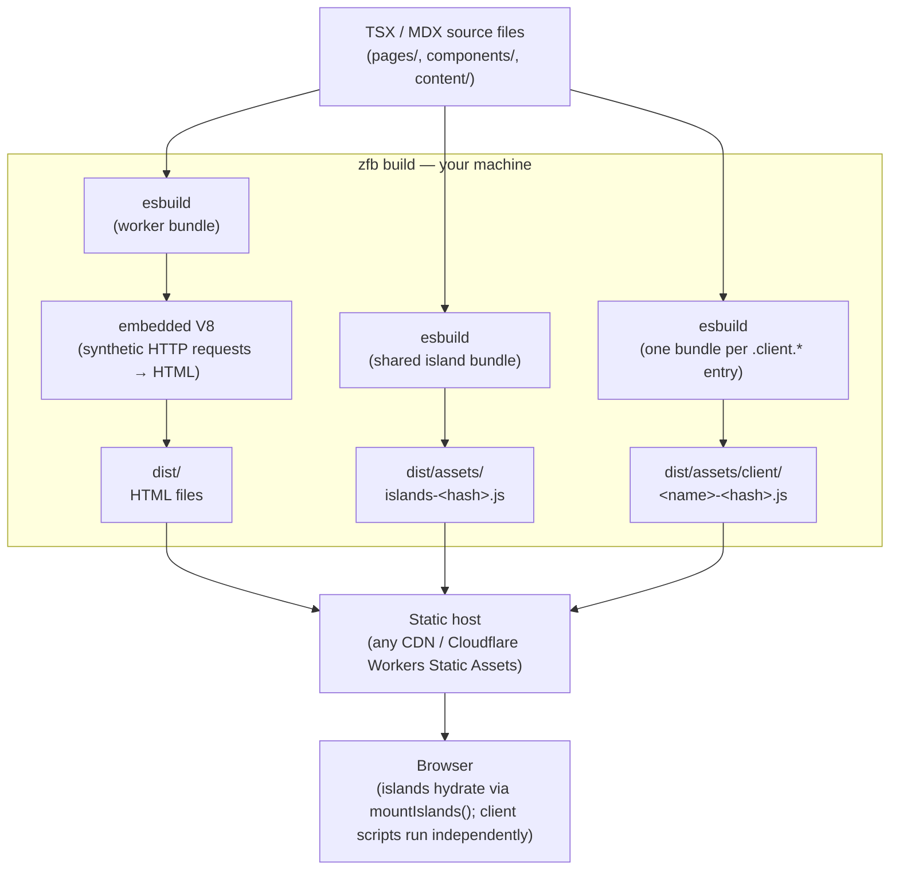

<Info title="このページで扱う内容">

ビルド時とブラウザの JS の分割、ビルド時パイプライン全体の図、なぜワーカーバンドルが
Cloudflare Workers モジュールの形をしているのか、そして esbuild と JS ランタイムを
差し替え可能に保つレイヤリングの原則。ステップごとのビルドパイプラインについては
[Build pipeline](./build-pipeline.mdx) を参照してください。

</Info>

zfb の JavaScript 出力は、*いつ・どこで* 動くかによって 2 つのクラスに分かれます。
ビルド時にしか存在しないワーカーバンドルと、ブラウザに配信され実際にエンドユーザーに
届く出力です。ブラウザ側のクラス自体は、アイランドバンドルと任意のクライアントスクリプト
バンドルという 2 つの独立したメンバーを持ちますが、アーキテクチャ上重要な分割は
「ビルド時かブラウザか」であって、ファイル数が固定で 2 つということではありません。
まずこの分割を頭の中で整理しておくと、残りのアーキテクチャがすっと腑に落ちます。

## ビルド時とブラウザ: 2 つの出力クラス

**ワーカーバンドル — ビルド時専用、ユーザーには決して配信されません。**

`zfb build` を実行すると、最初に起こるのは esbuild があなたの TSX ページ・レイアウト・
コンポーネントを単一のワーカーバンドルにコンパイルすることです。このバンドルは
Cloudflare Workers モジュールの形をしています。`fetch` ハンドラだけをエクスポートし、
それ以外には何もエクスポートしません。

```ts
export default {
  fetch(request: Request, env: Env, ctx: ExecutionContext): Response { ... }
};
```

Rust オーケストレーターはこのバンドルを組み込み V8 アイソレートにロードし、合成 HTTP
リクエスト（ページ URL ごとに 1 リクエスト）で駆動します。各合成リクエストは HTML の
`Response` を生成します。オーケストレーターはそれらのレスポンスを `dist/` にプレーンな
`.html` ファイルとして書き出します。ビルドが終わるとアイソレートは破棄されます。ビルド時、
ワーカーバンドルがあなたのマシンを離れることは決してありません。これは Rust
オーケストレーターが静的出力を生成するために駆動する *ツール* です。（同じバンドルの形は、
`prerender = false` のルート向けに変更なしで Cloudflare Workers にもデプロイされます。
その本番経路についてはこのページの後半と
[SSR guide](../guides/ssr-and-cloudflare-bindings.mdx) で扱います。）

**ブラウザ出力 — エンドユーザーに配信される、最大 2 つの独立したバンドル。**

`"use client"` でマークされたコンポーネントは、ブラウザ JavaScript の 1 つの発生源です。
esbuild はそれらすべてをまとめて単一の共有 ESM モジュール（`dist/assets/islands-<hash>.js`）
にバンドルし、それは HTML ファイルと並んで `dist/assets/` に配置されます。アイランドを含む
ビルドでは、このバンドルを参照する単一の `<script type="module">` タグがプロジェクト全体に
注入されます。バンドルは読み込み時に `mountIslands()` を呼び出し、ページ上のすべての
`[data-zfb-island]` 要素をハイドレートします。

もう 1 つ、アイランドのハイドレーションとは無関係な、独立した仕組みもブラウザ JavaScript を
生成します。`pages/`・`components/`・`src/` の下にある `<name>.client.<ext>`
（`.ts`/`.tsx`/`.js`/`.jsx`）という名前のファイルは、**クライアントスクリプトパイプライン**
（`crates/zfb-islands/src/client_scripts.rs` の `discover_client_scripts`）にオプトイン
します。発見された各エントリは独立してバンドルされ（`build_production_client_scripts`）、
自分自身の安定した URL から配信されます — 本番では `/assets/client/<name>-<hash>.js` に
コンテンツハッシュ化されます。クライアントスクリプトはページが `clientScript("name")` で
直接参照するプレーンな ESM エントリポイントであり、コンポーネントをハイドレートしたり
アイランドプロトコルに参加したりすることはありません。完全な規約については
[Client Scripts](../guides/client-scripts.mdx) を参照してください。

アイランドバンドルと任意のクライアントスクリプトバンドルを合わせたものが、エンドユーザーに
到達する *唯一* の JavaScript です — 上記のワーカーバンドルは決して届きません。プロジェクトは
アイランドバンドル、1 つ以上のクライアントスクリプトバンドル、両方、あるいはどちらもなし、を
出荷でき、両者は互いに独立しています。

重要な区別は「ビルド時かブラウザか」であって、固定されたバンドル数ではありません。
「ビルド時に動く」と「ブラウザで動く」を混同することが、zfb の動作についての混乱の
ほとんどの原因です。

`"use client"` でオプトインする方法については [Islands](./islands.mdx) を、
`.client.*` の規約については [Client Scripts](../guides/client-scripts.mdx) を
参照してください。

## 何がどこで動くのか



`zfb build` のボックス内のすべては、ビルド時にあなたのマシン上で動き、ビルドが終わると
終了します。静的デプロイでは、このボックス内のどれもリクエスト時にサーバーで動くことは
ありません。

ビルドオーケストレーターがこれらのステップをどう調整するのかという、より踏み込んだ話は
[Build engine](../architecture/build-engine.mdx) を参照してください。

## Hono / Cloudflare Workers への移植性という賭け

ワーカーバンドルの形 — `export default { fetch }` — は偶然ではありません。これは
Cloudflare Workers デプロイが期待するのと同じコントラクトです。つまり、Rust
オーケストレーターがビルド時に駆動するバンドルは、変更なしで Cloudflare Workers に
デプロイでき、静的プリレンダリングをオプトアウトしたルートに対しては workerd が本番で
それを実行します。

ルーティングのコア（`@takazudo/zfb-runtime` の `createPageRouter`）は Hono のアダプタ
パターンに従います。ルーターは 1 つ、エントリアダプタは複数。ビルド時アダプタは合成の
`Request` オブジェクトを与え、`Response` 文字列を収集します。Cloudflare Workers
アダプタはそれをワーカーの `fetch` ハンドラとして登録します。ルーター自身は、どのアダプタが
自分を駆動しているのかを知りません。

これが移植性の賭けです。バンドルの形を安定したコントラクトとして固定することで、zfb は
それを実行する JS エンジンから切り離されたままでいられます。ビルド時ホストは組み込み V8
アイソレート、本番ホストは workerd。コントラクト — `export default { fetch }` — は
どちらの文脈でも同じです。

`packages/zfb-adapter-cloudflare` は Cloudflare Workers 向けのデプロイアダプタです。
プロジェクトの `zfb.config.json` で `adapter: "@takazudo/zfb-adapter-cloudflare"` を
設定したときに `zfb build` が生成するバンドルを受け取り、`wrangler deploy` が
期待する薄いシェルで包みます。2 ファイル構成のワーカー出力と、ランタイムでリクエストが
どうディスパッチされるのかを深掘りするには
[SSR on a Worker (adapter mode)](./ssr-on-a-worker.mdx) を参照してください。

この設計の完全な根拠は [JS Runtime](../architecture/js-runtime.mdx) にあります。組み込み V8
ホストの設計と、なぜバンドルコントラクトがエンジン非依存なのか。SSG ファーストで
Hono/Workers のバンドル形を選んだのは、ビルド時と本番の実行環境を互換に保つためであり、
当初のインプロセス `deno_core` アプローチは、パフォーマンスと分離の要件が明確になった
時点で組み込み V8 アイソレートに置き換えられました。

## レイヤリングのまとめ

3 つのレイヤー、それぞれに明確な役割があります。

| レイヤー | 何を所有するか | 何を所有しないか |
|-------|-------------|----------------------|
| **あなたのソース** | ページ、コンポーネント、コンテンツ、スタイル | ビルドの仕組み |
| **zfb** | ビルドコントラクト — ルートテーブル、ページ props の形、アイランドプロトコル、クライアントスクリプトパイプライン、`dist/` のレイアウト | どのバンドラ、どの JS ランタイムか |
| **ツール** | esbuild（バンドル）、組み込み V8（ビルド時評価） | あなたのコードのセマンティクス |

zfb はコントラクトを所有します。どんな入力を受け付けるのか、出力がどう見えるのか、ビルドを
通してどんな不変条件が成り立つのか。esbuild と組み込み V8 ランタイムは実装の詳細であり、
ユーザーコードに触れることなく `RenderHost` トレイトの背後で差し替えられます。

バンドラは安くて速いノコギリです。zfb は大工です。

コントラクトの下流:

- [Islands](./islands.mdx) — `"use client"` がどのようにコンポーネントをアイランドバンドルにオプトインさせるのか
- [Client Scripts](../guides/client-scripts.mdx) — `.client.*` ファイルがどのように 2 つ目の独立したブラウザバンドルにオプトインするのか
- [Build engine](../architecture/build-engine.mdx) — Rust クレートがどのようにパイプラインを調整するのか
- [Incremental rebuild](./incremental-rebuild.mdx) — 依存グラフがどのように dev リビルドを高速に保つのか
