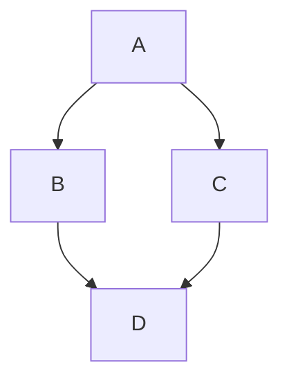

`mermaid` 機能は、フェンス付きコードブロックから [Mermaid](https://mermaid.js.org/) のダイアグラムをビルド時に描画します。

## 有効化

```ts
// zfb.config.ts
export default defineConfig({
  markdown: {
    features: {
      mermaid: true,
    },
  },
});
```

## 使い方

`mermaid` 言語タグを付けたフェンス付きコードブロックを書きます:

````md

````

プラグインは `<pre><code class="language-mermaid">` ブロックを次のように置き換えます:

```html
<div class="mermaid" data-mermaid="">graph TD; ...</div>
```

`data-mermaid` 属性は、クライアントサイドの Mermaid レンダラーにこのブロックを処理するよう知らせます。生のダイアグラムソースはそのまま埋め込まれる（山括弧などの文字は HTML エスケープされません）ため、レンダラーは無変更の Mermaid DSL を受け取ります。

## ビジターの順序

`MermaidPlugin` は hast フェーズで `SyntectPlugin` の**前に**実行されます。これにより、syntect が mermaid ブロックをシンタックスハイライトしようとしないことが保証されます。`<pre>` が `<div class="mermaid">` に置き換えられると、syntect の `<pre><code>` セレクターはもう一致しなくなるためです。
