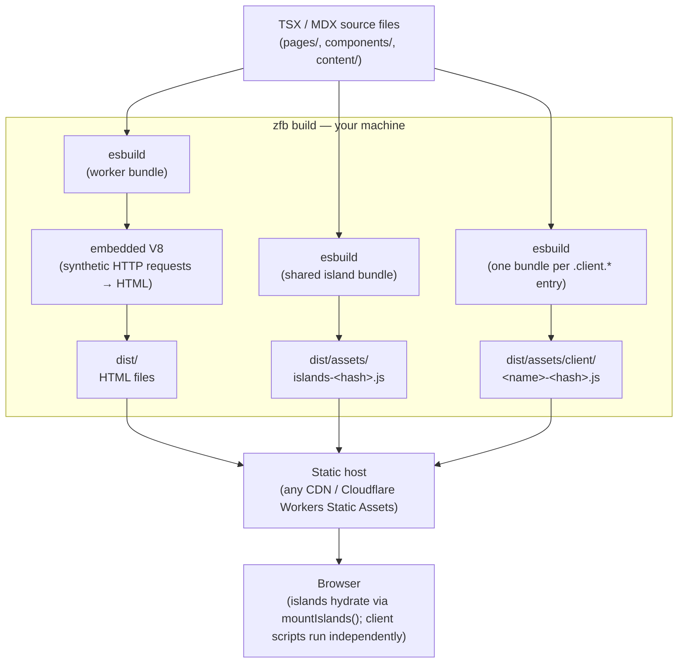

<Info title="What this page covers">

The build-time-vs-browser JS split, a diagram of the full build-time pipeline,
why the worker bundle is shaped as a Cloudflare Workers module, and the
layering principle that keeps esbuild and the JS runtime swappable. For the
step-by-step build pipeline, read [Build pipeline](./build-pipeline.mdx).

</Info>

zfb's JavaScript output splits into two classes by *when and where* it runs: a
worker bundle that exists only at build time, and browser-shipped output that
actually reaches end users. The browser class itself has two independent
members — the island bundle and any client-script bundles — but the split
that matters architecturally is build-time vs browser, not a fixed count of
files. Getting that split clear in your head first makes the rest of the
architecture fall into place.

## Build-time vs browser: the two classes of output

**Worker bundle — build-time only, never shipped to users.**

When you run `zfb build`, the first thing that happens is that esbuild compiles
your TSX pages, layouts, and components into a single worker bundle. This bundle
is shaped as a Cloudflare Workers module — it exports a `fetch` handler and
nothing else:

```ts
export default {
  fetch(request: Request, env: Env, ctx: ExecutionContext): Response { ... }
};
```

The Rust orchestrator loads this bundle into an embedded V8 isolate
and drives it with synthetic HTTP requests — one request per page
URL. Each synthetic request produces an HTML `Response`. The orchestrator writes
those responses to `dist/` as plain `.html` files. When the build finishes, the
isolate is torn down. At build time the worker bundle never leaves your machine — it is the
*tool* the Rust orchestrator drives to produce the static output. (The
same bundle shape also deploys unchanged to Cloudflare Workers for any
`prerender = false` routes; that production path is covered later in
this page and in the [SSR guide](../guides/ssr-and-cloudflare-bindings.mdx).)

**Browser output — shipped to end users, as up to two independent bundles.**

Components marked with `"use client"` are one source of browser JavaScript. esbuild
bundles all of them together into a single shared ESM module
(`dist/assets/islands-<hash>.js`), which lands in `dist/assets/` alongside the HTML
files. A single `<script type="module">` tag referencing this bundle is injected
project-wide on island-bearing builds; the bundle calls `mountIslands()` at load time,
which hydrates every `[data-zfb-island]` element on the page.

A second, independent mechanism also produces browser JavaScript, with nothing to do
with island hydration: any file named `<name>.client.<ext>` (`.ts`/`.tsx`/`.js`/`.jsx`)
under `pages/`, `components/`, or `src/` opts into the **client-script pipeline**
(`discover_client_scripts` in `crates/zfb-islands/src/client_scripts.rs`). Each
discovered entry is bundled independently (`build_production_client_scripts`) and
served from its own stable URL — content-hashed to `/assets/client/<name>-<hash>.js` in
production. A client script is a plain ESM entry point a page references directly with
`clientScript("name")`; it does not hydrate a component or participate in the island
protocol. See [Client Scripts](../guides/client-scripts.mdx) for the full convention.

The island bundle and any client-script bundles together are the *only* JavaScript
that ever reaches end users — the worker bundle above never does. A project can ship
an islands bundle, one or more client-script bundles, both, or neither; the two are
independent of each other.

The distinction that matters is build-time vs browser, not a fixed bundle count.
Conflating "runs at build time" with "runs in the browser" is the source of most
confusion about how zfb works.

See [Islands](./islands.mdx) for how to opt in with `"use client"`, and
[Client Scripts](../guides/client-scripts.mdx) for the `.client.*` convention.

## What runs where



Everything inside the `zfb build` box runs on your machine at build time and
exits when the build finishes. Nothing in that box runs on a server at request
time for static deployments.

For the deeper story on how the build orchestrator coordinates these steps, read
[Build engine](../architecture/build-engine.mdx).

## The Hono / Cloudflare Workers portability bet

The worker bundle shape — `export default { fetch }` — is not accidental. It is
the same contract a Cloudflare Workers deployment expects. That means the bundle
the Rust orchestrator drives at build time can be deployed to Cloudflare Workers
unchanged, and workerd will execute it in production for any route that opts out
of static prerendering.

The routing core (`createPageRouter` from `@takazudo/zfb-runtime`) follows the
Hono adapter pattern: one router, multiple entry adapters. The build-time
adapter feeds it synthetic `Request` objects and collects `Response` strings.
The Cloudflare Workers adapter registers it as the worker's `fetch` handler. The
router itself does not know which adapter is driving it.

This is the portability bet: by fixing the bundle shape as the stable contract,
zfb stays decoupled from which JS engine executes it. The build-time host is an
embedded V8 isolate. The production host is workerd. The contract —
`export default { fetch }` — is the same in both contexts.

`packages/zfb-adapter-cloudflare` is the deployment adapter for Cloudflare
Workers. It takes the bundle `zfb build` produces when the project's
`zfb.config.json` sets `adapter: "@takazudo/zfb-adapter-cloudflare"`, and
wraps it in the thin shell that `wrangler deploy` expects. For a deep dive into
the two-file worker output and how requests are dispatched at runtime, see
[SSR on a Worker (adapter mode)](./ssr-on-a-worker.mdx).

The full rationale for this design is in [JS Runtime](../architecture/js-runtime.mdx):
the embedded V8 host design and why the bundle contract is engine-agnostic.
The SSG-first, Hono/Workers bundle shape was chosen to keep the build-time
and production execution environments interchangeable, and the original
in-process `deno_core` approach was superseded by the embedded V8 isolate
once performance and isolation requirements became clear.

## Layering summary

Three layers, each with a distinct job:

| Layer | What it owns | What it does NOT own |
|-------|-------------|----------------------|
| **Your source** | Pages, components, content, styles | Build mechanics |
| **zfb** | The build contract — route table, page props shape, island protocol, client-script pipeline, `dist/` layout | Which bundler, which JS runtime |
| **Tools** | esbuild (bundling), embedded V8 (build-time evaluation) | Your code's semantics |

zfb owns the contract — what inputs it accepts, what the output looks like, and
what invariants hold across the build. esbuild and the embedded V8 runtime are
implementation details that can be swapped behind the `RenderHost` trait without
touching user code.

The bundler is the cheap, fast saw. zfb is the carpenter.

Downstream of the contract:

- [Islands](./islands.mdx) — how `"use client"` opts a component into the island bundle
- [Client Scripts](../guides/client-scripts.mdx) — how `.client.*` files opt into a second, independent browser bundle
- [Build engine](../architecture/build-engine.mdx) — how the Rust crates coordinate the pipeline
- [Incremental rebuild](./incremental-rebuild.mdx) — how the dependency graph keeps dev rebuilds fast
