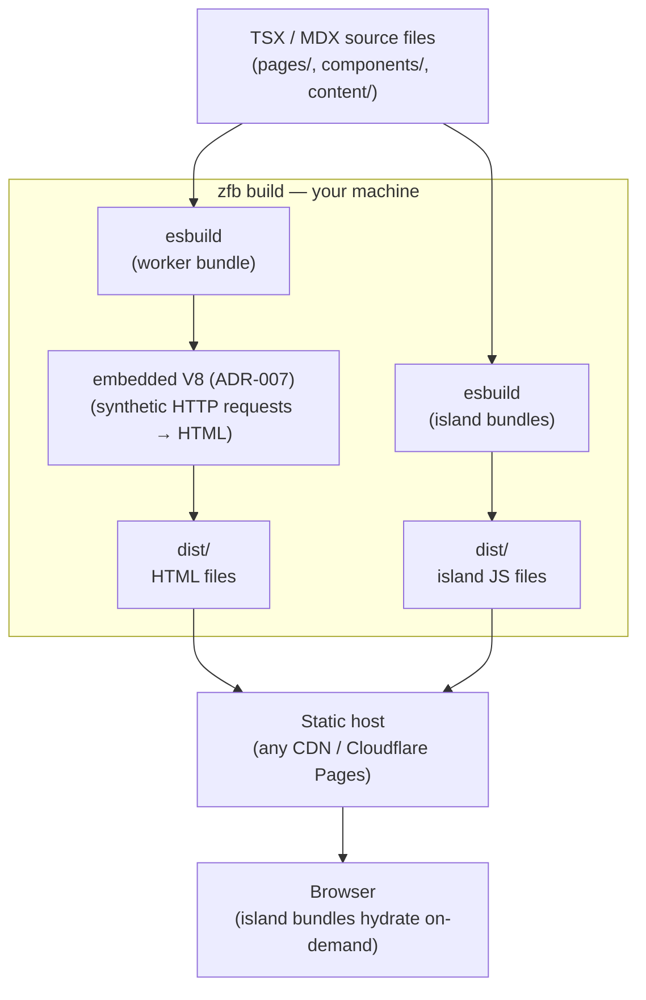

<Info title="What this page covers">

The two-bundle model, a diagram of the full build-time pipeline, why the worker
bundle is shaped as a Cloudflare Workers module, and the layering principle that
keeps esbuild and the JS runtime swappable. For the step-by-step build pipeline,
read [Build pipeline](/concepts/build-pipeline).

</Info>

zfb produces two kinds of JavaScript output, sends them to two different
destinations, and uses two different execution environments to get there. Getting
that split clear in your head first makes the rest of the architecture fall into
place.

## The two bundles, two destinations

**Worker bundle — build-time only, never shipped to users.**

When you run `zfb build`, the first thing that happens is that esbuild compiles
your TSX pages, layouts, and components into a single worker bundle. This bundle
is shaped as a Cloudflare Workers module — it exports a `fetch` handler and
nothing else:

```ts
export default {
  fetch(request: Request, env: Env, ctx: ExecutionContext): Response { ... }
};
```

The Rust orchestrator loads this bundle into an embedded V8 isolate (ADR-007)
and drives it with synthetic HTTP requests — one request per page
URL. Each synthetic request produces an HTML `Response`. The orchestrator writes
those responses to `dist/` as plain `.html` files. When the build finishes, the
isolate is torn down. The worker bundle never leaves your machine; it is the
*tool* that produces the static output, not the output itself.

**Island bundles — shipped to the browser, on-demand.**

Components marked with `"use client"` are a different story. esbuild bundles
each one as a separate ESM module, and those bundles land in `dist/` alongside
the HTML files. The browser downloads them on-demand and hydrates the
corresponding DOM nodes. Island bundles are the *only* JavaScript that ever
reaches end users.

The distinction matters because the two bundles have completely different
lifetimes, different execution environments, and different optimization targets.
Conflating them is the source of most confusion about how zfb works.

See [Islands](/concepts/islands) for how to opt in with `"use client"`.

## What runs where



Everything inside the `zfb build` box runs on your machine at build time and
exits when the build finishes. Nothing in that box runs on a server at request
time for static deployments.

For the deeper story on how the build orchestrator coordinates these steps, read
[Build engine](/architecture/build-engine).

## The Hono / Cloudflare Workers portability bet

The worker bundle shape — `export default { fetch }` — is not accidental. It is
the same contract a Cloudflare Workers deployment expects. That means the bundle
the Rust orchestrator drives at build time can be deployed to Cloudflare Workers
unchanged, and workerd will execute it in production for any route that opts out
of static prerendering.

The routing core (`createPageRouter` from `@takazudo/zfb-runtime`) follows the
Hono adapter pattern: one router, multiple entry adapters. The build-time
adapter feeds it synthetic `Request` objects and collects `Response` strings.
The Cloudflare Workers adapter registers it as the worker's `fetch` handler. The
router itself does not know which adapter is driving it.

This is the portability bet: by fixing the bundle shape as the stable contract,
zfb stays decoupled from which JS engine executes it. The build-time host is an
embedded V8 isolate (ADR-007). The production host is workerd. The contract —
`export default { fetch }` — is the same in both contexts.

`packages/zfb-adapter-cloudflare` is the deployment adapter for Cloudflare
Workers. It takes the bundle produced by `zfb build --target=cloudflare` and
wraps it in the thin shell that `wrangler deploy` expects.

The full rationale for this design is in [JS Runtime](/architecture/js-runtime):
the embedded V8 host design and why the bundle contract is engine-agnostic.
The SSG-first, Hono/Workers bundle shape was chosen to keep the build-time
and production execution environments interchangeable, and the original
in-process `deno_core` approach was superseded by the embedded V8 isolate
once performance and isolation requirements became clear.

## Layering summary

Three layers, each with a distinct job:

| Layer | What it owns | What it does NOT own |
|-------|-------------|----------------------|
| **Your source** | Pages, components, content, styles | Build mechanics |
| **zfb** | The build contract — route table, page props shape, island protocol, `dist/` layout | Which bundler, which JS runtime |
| **Tools** | esbuild (bundling), embedded V8 (build-time evaluation) | Your code's semantics |

zfb owns the contract — what inputs it accepts, what the output looks like, and
what invariants hold across the build. esbuild and the embedded V8 runtime are
implementation details that can be swapped behind the `RenderHost` trait without
touching user code.

The bundler is the cheap, fast saw. zfb is the carpenter.

Downstream of the contract:

- [Islands](/concepts/islands) — how `"use client"` opts a component into the island bundle
- [Build engine](/architecture/build-engine) — how the Rust crates coordinate the pipeline
- [Incremental rebuild](/concepts/incremental-rebuild) — how the dependency graph keeps dev rebuilds fast
