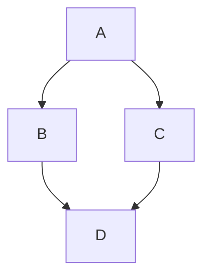

The `mermaid` feature renders [Mermaid](https://mermaid.js.org/) diagrams from fenced code blocks at build time.

## Enable

```ts
// zfb.config.ts
export default defineConfig({
  markdown: {
    features: {
      mermaid: true,
    },
  },
});
```

## Usage

Write a fenced code block with the `mermaid` language tag:

````md

````

The plugin replaces the `<pre><code class="language-mermaid">` block with:

```html
<div class="mermaid" data-mermaid="">graph TD; ...</div>
```

The `data-mermaid` attribute signals a client-side Mermaid renderer to process the block. The raw diagram source is embedded verbatim (angle brackets and other characters are NOT HTML-escaped) so the renderer receives the unmodified Mermaid DSL.

## Visitor ordering

`MermaidPlugin` runs **before** `SyntectPlugin` in the hast phase. This ensures syntect does not attempt to syntax-highlight mermaid blocks; once the `<pre>` is replaced by a `<div class="mermaid">`, syntect's `<pre><code>` selector no longer matches it.
